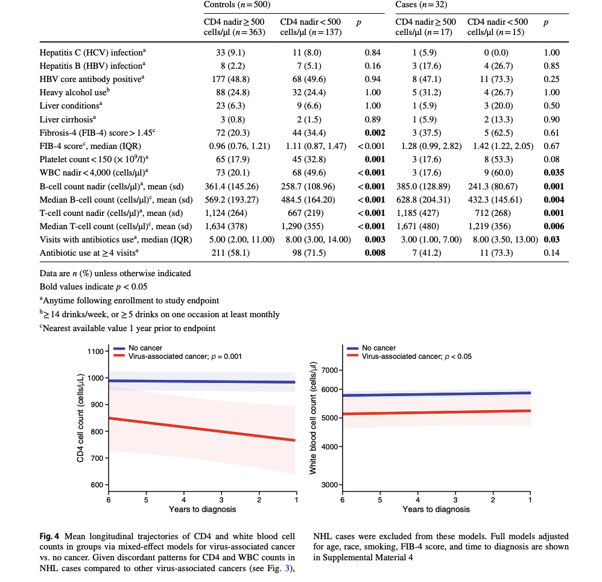
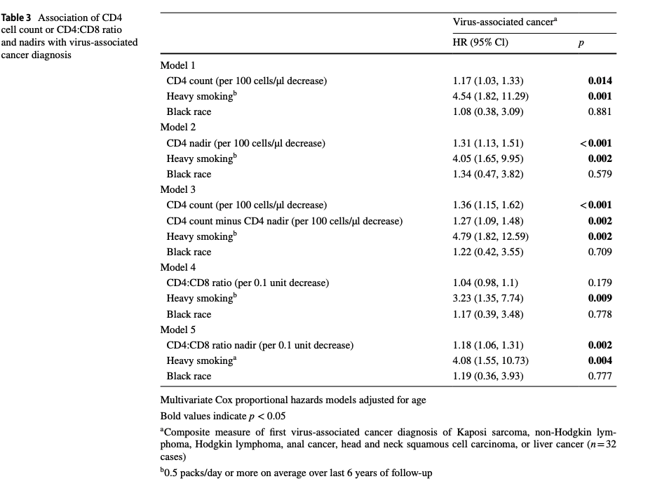

# Corresponding scripts developed for high-throughput analyis of risk factors associated with the development of virus-associated cancer using linear mixed effects model

<td></td> 
  

## Shiny app displays report of analysis
<td></td> 
  