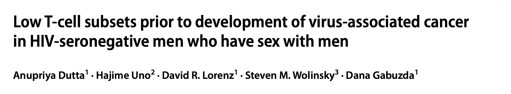

# Linear mixed effects models for analyis of risk factors associated with the development of virus-associated cancer in published paper

<a href="src/" style="font-size: 15px; text-decoration: none">Code developed collaboratively with co-authors and adapted for paper found here for high throughput permutations of model parameters</a>

<a href="HIVneg_tcellsubsets.pdf" style="font-size: 15px; text-decoration: none">pdf of paper found here</a>
<td></td> 
  

<td></td> 
  

<td></td> 
  