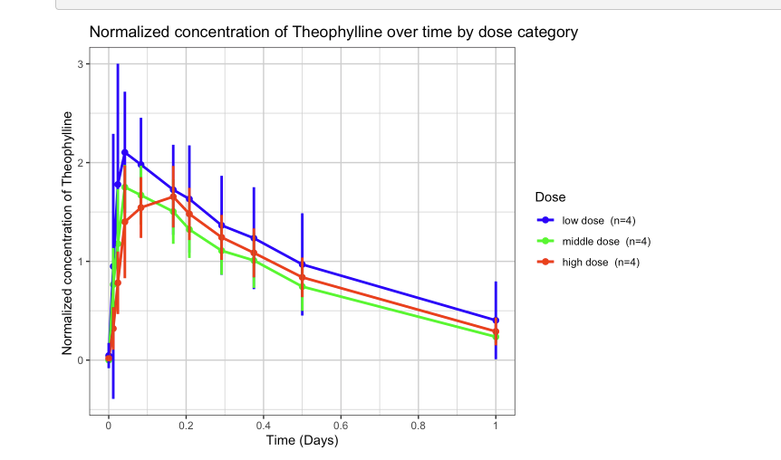
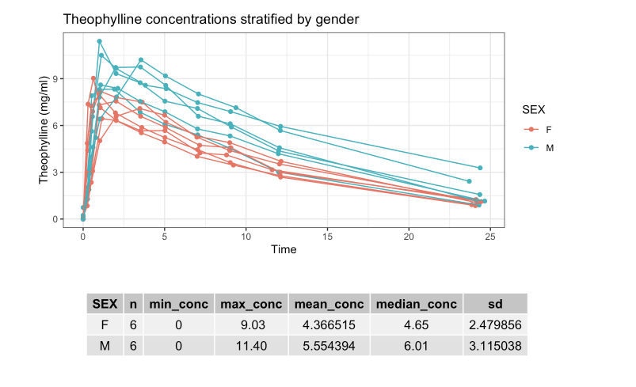
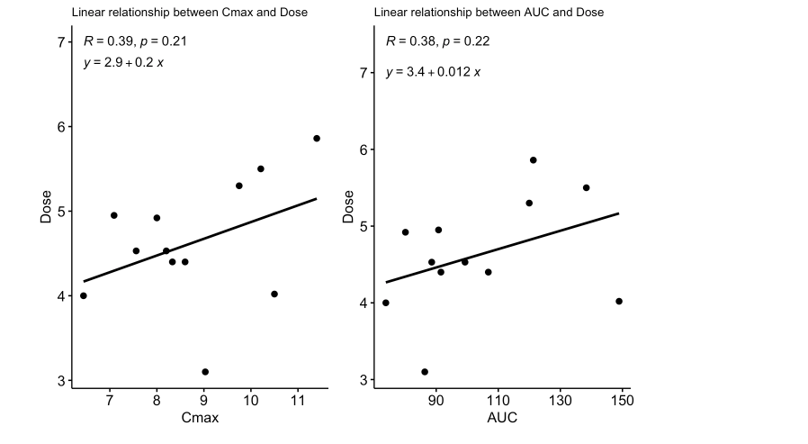
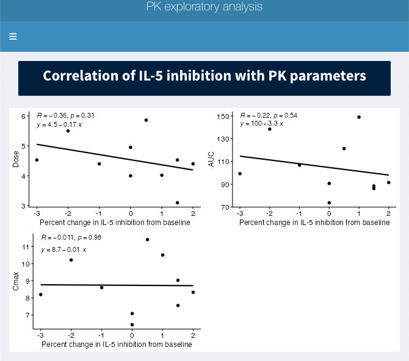

## Summary of analysis and shiny app features run on open source data

## Characterization of single ascending dose data of Theophylline

Rmarkdown describes analysis of input data gathered from biochemical assay and demographic data used to conduct analysis shown below.

<a href="Sample_SingleAscendingDoseanalysis.html" style="font-size: 15px; text-decoration: none">Rmarkdown file found here</a>

### Select figures from analysis

<td></td>  
  

<td></td> 
  

<td></td>  
  

<td></td> 
  

## Shiny app displays report of analysis
<td></td> 
  

<a href="src/PK_shinyapp.R" style="font-size: 15px; text-decoration: none">Shiny app found here of the report</a>