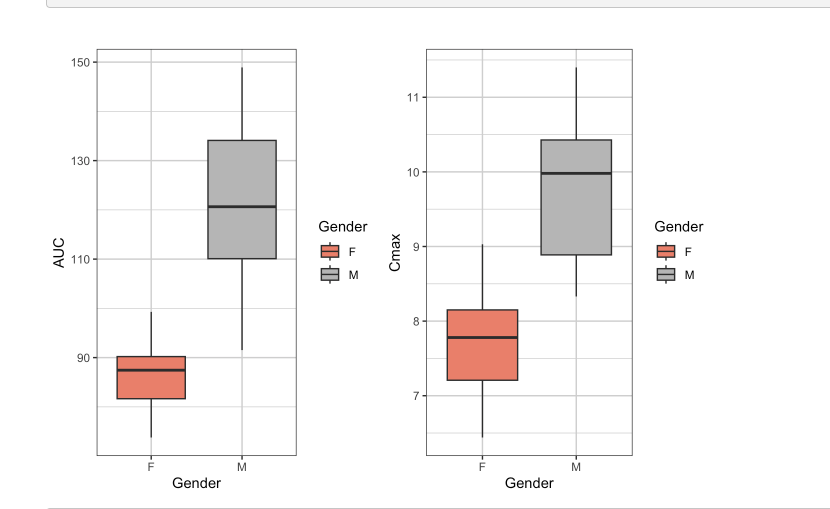

## Summary of analysis and shiny app features

## Characterization of single ascending dose data of Theophylline

Rmarkdown describes analysis of input data gathered from biochemical assay and demographic data used to conduct analysis shown below.

### Select figures

<td></td>  
  

<td></td> 
  

<td></td>  
  

<td></td> 
  

## Shiny app displays report of analysis
<td></td> 
  